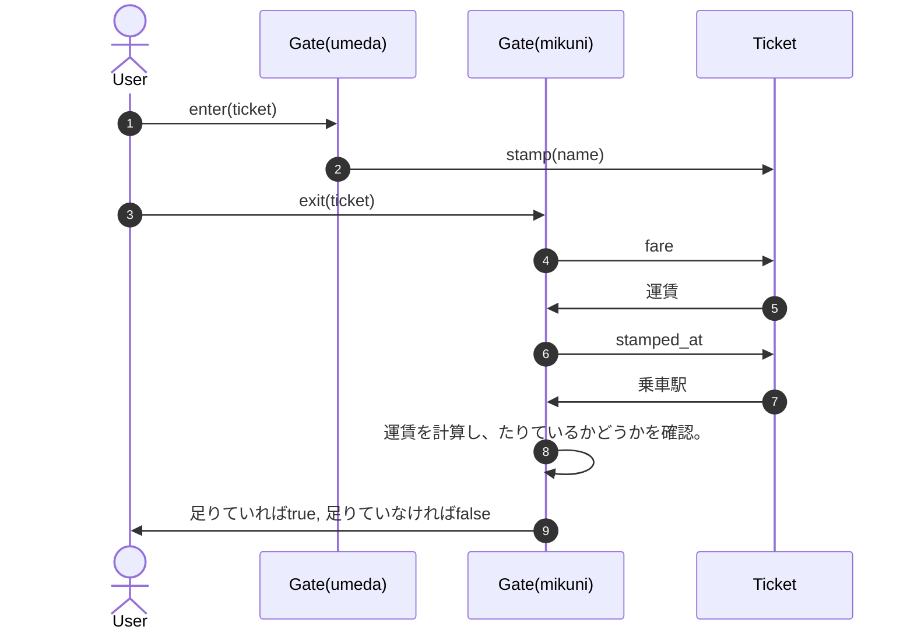

```mermaid
sequenceDiagram
actor user as User
participant umeda as Gate(umeda)
participant mikuni as Gate(mikuni)
participant Ticket as Ticket
autonumber
    user->>umeda: enter(ticket)
    umeda->>Ticket: stamp(name)
    user->>mikuni: exit(ticket)
    mikuni->>Ticket: fare
    Ticket->>mikuni: 運賃
    mikuni->>Ticket: stamped_at
    Ticket->>mikuni: 乗車駅
    mikuni->>mikuni: 運賃を計算し、たりているかどうかを確認。
    mikuni->>user: 足りていればtrue, 足りていなければfalse
```
